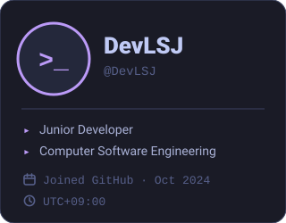
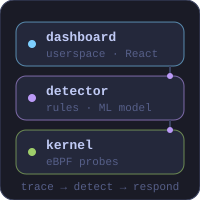
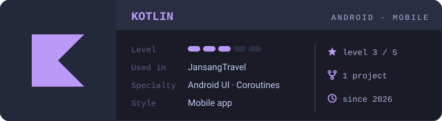
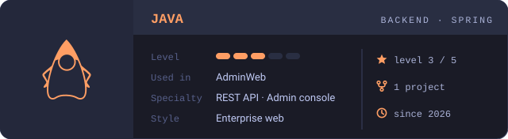
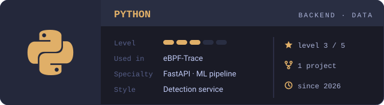
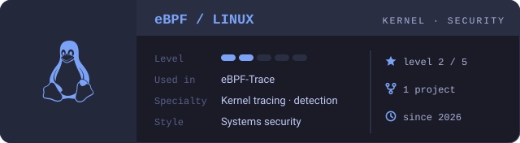
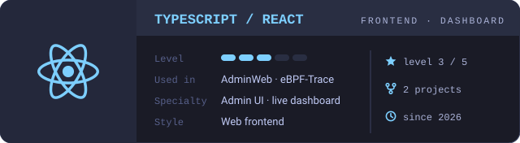
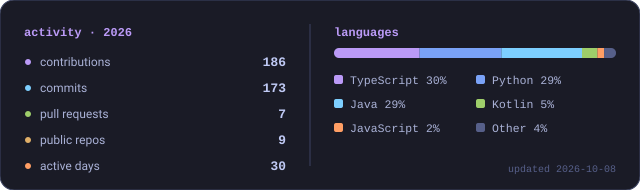

<!--
  Profile README for github.com/DevLSJ
  · Visual assets live in assets/ and are generated by scripts/gen_assets.py
  · assets/activity.svg is refreshed daily by .github/workflows/refresh-stats.yml
  · GitHub renders tables as width:max-content with border-box cells
    (13px side padding), so every <td> width = content width + 26 and every
    image carries an explicit pixel width. Outer table: 304 + 536 + 3 = 843 ≤ 846 (profile README width at ≥1280px).
-->

  
  
  
  

 

  

<table>
<tr>
<td width="304" valign="top">

### :: now

2026 · 캡스톤 프로젝트 
**eBPF-Trace** — 리눅스 커널 레벨에서 공급망 공격을 탐지하는 시스템을 만들고 있습니다.
eBPF 프로브로 커널 이벤트를 수집하고, 탐지 규칙과 ML 모델로 판별한 뒤, 대응 에이전트와 React 대시보드까지 이어지는 흐름을 직접 구현 중입니다.

### :: pinned

<table>
<tr>
<td width="66"></td>
<td width="208"><b><a href="https://github.com/DevLSJ/eBPF-Trace">eBPF-Trace</a></b> <a href="https://github.com/DevLSJ/eBPF-Trace">↗</a> 커널 레벨 공급망 공격 탐지 · Python / C / TS</td>
</tr>
<tr>
<td width="66"></td>
<td width="208"><b><a href="https://github.com/DevLSJ/AdminWeb">AdminWeb</a></b> <a href="https://github.com/DevLSJ/AdminWeb">↗</a> Company solution 관리자 웹 · Java / TS</td>
</tr>
<tr>
<td width="66"></td>
<td width="208"><b><a href="https://github.com/DevLSJ/JansangTravel">JansangTravel</a></b> <a href="https://github.com/DevLSJ/JansangTravel">↗</a> 모바일 프로그래밍 텀프로젝트 · Kotlin</td>
</tr>
<tr>
<td width="66"></td>
<td width="208"><b><a href="https://github.com/DevLSJ/CLI_Crypto">CLI_Crypto</a></b> <a href="https://github.com/DevLSJ/CLI_Crypto">↗</a> Crypto Programming Project</td>
</tr>
</table>

### :: interests

**#eBPF** kernel tracing 
**#Linux** systems programming 
**#Security** supply-chain attack detection 
**#Android** Kotlin mobile apps 
**#Backend** Java · Python · PostgreSQL

### :: tools

       

</td>
<td width="536" valign="top">

### :: about me

<table>
<tr>
<td width="281" valign="top">

안녕하세요, 컴퓨터소프트웨어공학을 전공하는 주니어 개발자 **DevLSJ**입니다.

Kotlin으로 모바일 앱을, Java와 TypeScript로 관리자 웹을, Python으로 탐지 서비스를 만들어 봤습니다. 지금은 **eBPF**로 리눅스 커널 레벨에서 공급망 공격을 잡아내는 캡스톤 프로젝트에 집중하고 있습니다.

애플리케이션 위에서만 보던 문제를 커널 아래에서 다시 보는 일에 재미를 붙였고, 새 시스템 기술은 읽는 것보다 직접 만들어 보면서 배우는 편입니다.

</td>
<td width="226" valign="top"></td>
</tr>
</table>

<b>UPDATED</b> · 2026-09-28

### :: tech stack

### :: activity

</td>
</tr>
</table>

layout inspired by classic tumblr profile themes · palette: tokyo night · icons: simple icons (cc0)

