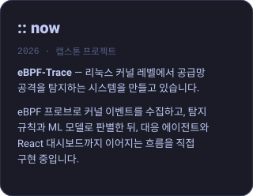
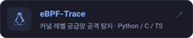
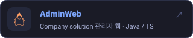
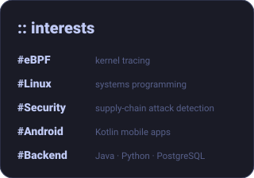
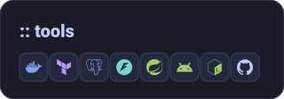
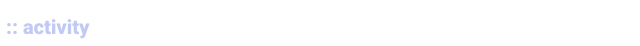

<!--
  Profile README for github.com/DevLSJ
  · Every block is an SVG generated by scripts/gen_assets.py (text lives in its TEXT / STACKS / PROFILE dicts).
    Edit there, run `python3 scripts/gen_assets.py`, commit.
  · assets/activity.svg is refreshed daily by .github/workflows/refresh-stats.yml.
  · The two-column table holds only width="100%" images, so it shrinks proportionally
    (sidebar : main = 320 : 640) at any window width instead of overflowing.
-->

  
  
  
  

 

  

<table>
<tr>
<td valign="top">

</td>
<td valign="top">

</td>
</tr>
</table>

layout inspired by classic tumblr profile themes · palette: tokyo night · icons: simple icons (cc0)

